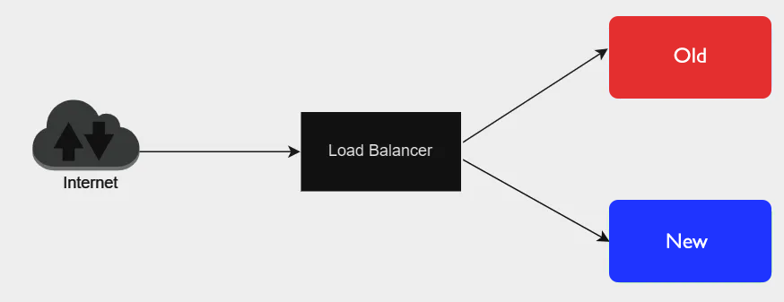

## Canary - Docker Swarm nginx - Exercice

Mettez en place une architecture de déploiement Canary permettant de faire fonctionner
un service nginx avec en front un load-balancer utilisant aussi nginx.

- Le service nginx Old affichera **Welcome Canary Old**, alors que le service nginx New affichera **Welcome Canary New**. 
- Le load-balancer lui sera accessible sur le port http **8484**.
- L'augmentation du service New sera effectué en modifiant la configuration du load-balancer.

